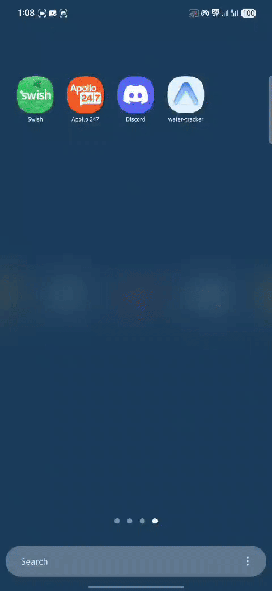

# Water Tracker

A feature-rich React Native water tracking app built with Expo. Track your daily water intake with smart reminders and Android home screen widgets.



## Download

You can download the latest Android APK directly from the [Releases](https://github.com/Aashi3005/water-tracker-app/releases/tag/1.0.0) page:

**[Download APK (v1.0.0)](https://github.com/Aashi3005/water-tracker-app/releases/tag/1.0.0)**

> **Note:** Since this is a weekend project and not on the Play Store, you may need to "Allow installation from unknown sources" in your Android settings.

## Features

### Core Water Tracking
- **Quick Add Buttons**: Instantly log 100ml, 250ml, or 500ml with a single tap
- **Undo Functionality**: Made a mistake? Undo your last entry
- **Daily Goal**: Customizable daily water intake target (default: 3500ml)
- **Progress Visualization**: Beautiful animated circular progress ring
- **7-Day History**: View your water intake for the past week with progress bars

### Smart Reminders
- **Customizable Scheduling**: Reminders between your wake time and sleep time
- **Flexible Intervals**: Choose from 15 minutes to 4 hours between reminders
- **Hinglish Messages**: Fun Hindi-English mix reminder messages like:
  - "Bhai paani pi, kidney boli please!"
  - "Hydration ka time hai, chal uth!"
  - "Paani pi, glow aayega FREE mein!"

### Android Home Screen Widget
- **Battery-Style Display**: Visual water level indicator
- **Quick Actions**: +/- buttons for instant logging without opening the app
- **Real-Time Sync**: Widget and app stay in sync


### User Experience
- **Haptic Feedback**: Tactile response for all interactions
- **Dark Mode Support**: Adaptive theming
- **Smooth Animations**: 250ms animated progress updates
- **Color-Coded Progress**: Blue (in progress) to Green (goal reached)

## Tech Stack

| Category | Technology |
|----------|------------|
| Framework | Expo 54 + React Native 0.81.5 |
| Language | TypeScript 5.9.2 |
| Navigation | Expo Router (file-based routing) |
| Storage | AsyncStorage |
| Animations | React Native Reanimated 4.1.1 |
| Notifications | Expo Notifications |
| Widgets | react-native-android-widget |
| State Management | Custom React Hooks |

## Project Structure

```
water-tracker/
├── app/                          # Expo Router screens
│   ├── _layout.tsx              # Root layout & navigation setup
│   ├── index.tsx                # Home screen with progress ring
│   ├── history.tsx              # 7-day history view
│   ├── settings.tsx             # Settings & configuration
│   └── log-water.tsx            # Deep link handler for voice commands
│
├── components/                   # Reusable UI components
│   ├── ProgressRing.tsx         # Animated circular progress indicator
│   ├── WaterButton.tsx          # Quick-add water button
│   └── DayCard.tsx              # Historical day card
│
├── hooks/                        # Custom React hooks
│   └── useWater.ts              # Main water tracking state & logic
│
├── storage/                      # Data persistence
│   └── waterStorage.ts          # AsyncStorage wrapper
│
├── utils/                        # Utility functions
│   ├── notifications.ts         # Notification scheduling
│   ├── parseWaterAmount.ts      # Voice command parsing
│   └── date.ts                  # Date formatting
│
├── widgets/                      # Android widget implementation
│   ├── widget-task-handler.tsx  # Widget UI & interaction logic
│   └── WidgetConfigScreen.tsx   # Widget configuration screen
│
├── plugins/                      # Expo config plugins
│   └── withAndroidAppActions.js # Google Assistant integration
│
├── types/                        # TypeScript definitions
│   └── water.ts                 # Data models
│
└── assets/                       # Images & icons
```

## Screens

### Home Screen
The main dashboard displaying:
- Large animated progress ring showing daily progress
- Current consumption and goal display
- Undo button (when available)
- Quick add buttons (+100ml, +250ml, +500ml)
- Statistics cards

### History Screen
View your water intake over the past 7 days:
- Each day shown as a card with progress bar
- Today's card highlighted with blue border
- Pull-to-refresh functionality

### Settings Screen
Configure your preferences:
- **Daily Goal**: Set your target intake (1-10,000ml)
- **Reminder Interval**: 15 min, 30 min, 1 hr, 2 hrs, 3 hrs, or 4 hrs
- **Wake Time**: When to start reminders
- **Sleep Time**: When to stop reminders
- **Reset All Data**: Clear all tracking data

## Data Model

```typescript
interface WaterData {
  entries: Record<string, number>;  // "YYYY-MM-DD" → ml consumed
  goal: number;                      // Daily target in ml
  reminderInterval?: number;         // Minutes between reminders
  wakeTime?: string;                 // "HH:mm" format
  sleepTime?: string;                // "HH:mm" format
}
```

### Storage Keys
| Key | Purpose |
|-----|---------|
| `@water_tracker_data` | Main water tracking data |
| `@water_tracker_last_accessed` | Day change detection |
| `@water_tracker_widget_last_added` | Widget undo state |

## Default Values

| Setting | Default |
|---------|---------|
| Daily Goal | 3500ml |
| Reminder Interval | 60 minutes |
| Wake Time | 07:00 |
| Sleep Time | 22:00 |

## Installation

### Prerequisites
- Node.js 18+
- Expo CLI
- Android Studio (for Android development)
- Xcode (for iOS development, macOS only)

### Setup

1. Clone the repository:
```bash
git clone <repository-url>
cd water-tracker
```

2. Install dependencies:
```bash
npm install
```

3. Start the development server:
```bash
npx expo start
```

4. Run on device/simulator:
```bash
# iOS
npx expo run:ios

# Android
npx expo run:android
```

## Building for Production

### Android
```bash
# Development build
npx expo run:android

# Production APK/AAB
eas build --platform android
```

### iOS
```bash
# Development build
npx expo run:ios

# Production IPA
eas build --platform ios
```

## Voice Command Setup (Google Assistant)

The app supports Google Assistant voice commands through deep links.

### URL Scheme
```
watertracker://log-water?amount=<amount>
```

### Supported Commands
- "Hey Google, log 250ml in Water Tracker"
- "Hey Google, add half a liter in Water Tracker"
- "Hey Google, log 2 glasses in Water Tracker"

### Supported Units
| Unit | Conversion |
|------|------------|
| ml | 1 |
| liters | 1000 |
| glass | 250 |
| cup | 240 |
| ounce (oz) | 30 |
| bottle | 500 |

## Android Widget

### Adding the Widget
1. Long press on your home screen
2. Select "Widgets"
3. Find "Water Tracker" widget
4. Drag to home screen

### Widget Features
- **+ Button**: Add 250ml water
- **- Button**: Undo last addition
- **Display**: Shows current/goal and percentage
- **Colors**: Blue (in progress), Green (goal reached)

### Widget Configuration
```json
{
  "minWidth": "180dp",
  "minHeight": "120dp",
  "resizeMode": "horizontal|vertical",
  "updatePeriodMillis": 1800000
}
```

## Notifications

### Platform-Specific Implementation

**iOS**:
- Calendar trigger with daily repeat
- Badge display enabled

**Android**:
- Daily trigger at specified times
- Notification channel with MAX importance
- Vibration pattern: [0, 500, 500, 500]
- Lockscreen visibility: PUBLIC

### Reminder Messages
The app includes 19 fun Hinglish (Hindi-English) reminder messages for Indian users.

## State Management

The app uses a custom `useWater` hook for state management:

### Features
- **Optimistic Updates**: UI updates immediately, syncs with storage
- **Day Change Detection**: Auto-resets at midnight
- **App Lifecycle Handling**: Refreshes on foreground
- **Error Recovery**: Reverts on storage errors

### API
```typescript
const {
  consumed,          // Today's consumption (ml)
  goal,              // Daily goal (ml)
  progress,          // Progress percentage (0-100)
  reminderInterval,  // Minutes between reminders
  wakeTime,          // Wake time string
  sleepTime,         // Sleep time string
  lastAddedAmount,   // Last added amount (for undo)
  canUndo,           // Whether undo is available
  loading,           // Loading state
  error,             // Error message
  addWater,          // Add water function
  removeWater,       // Remove water function
  undo,              // Undo last addition
  setGoal,           // Update goal
  setReminderInterval,
  setWakeTime,
  setSleepTime,
  refresh,           // Manual refresh
} = useWater();
```

## Components

### ProgressRing
Animated circular progress indicator using React Native SVG and Reanimated.

```typescript
<ProgressRing
  progress={0.75}      // 0-1 value
  size={280}           // Diameter in pixels
  strokeWidth={12}     // Ring thickness
  color="#3B82F6"      // Progress color
  backgroundColor="#E5E7EB"
>
  {/* Children centered inside */}
</ProgressRing>
```

### WaterButton
Quick-add button with loading state and haptic feedback.

```typescript
<WaterButton
  amount={250}
  onPress={() => addWater(250)}
  disabled={loading}
/>
```

### DayCard
Historical day display with progress bar.

```typescript
<DayCard
  date="Monday, Jan 1"
  amount={2500}
  goal={3500}
  isToday={true}
/>
```

## Color Scheme

| Color | Hex | Usage |
|-------|-----|-------|
| Primary Blue | #3B82F6 | Progress (< 100%) |
| Success Green | #10B981 | Goal reached |
| Error Red | #DC2626 | Errors |
| Text Dark | #111827 | Light mode text |
| Text Light | #F9FAFB | Dark mode text |
| Background | #FFFFFF | Light mode |
| Background Dark | #111827 | Dark mode |

## App Flow

```
┌─────────────────┐
│   App Start     │
└────────┬────────┘
         │
         ▼
┌─────────────────┐
│ Request Perms   │
│ (Notifications) │
└────────┬────────┘
         │
         ▼
┌─────────────────┐
│  Home Screen    │◄──────────────┐
│                 │               │
│ • Progress Ring │               │
│ • Quick Add     │               │
│ • Undo Button   │               │
└────────┬────────┘               │
         │                        │
    ┌────┴────┐                   │
    │         │                   │
    ▼         ▼                   │
┌───────┐ ┌───────┐               │
│History│ │Settings│              │
└───────┘ └───────┘               │
                                  │
┌─────────────────┐               │
│ Voice Command   │───────────────┘
│ (Deep Link)     │
└─────────────────┘

┌─────────────────┐
│ Android Widget  │──► AsyncStorage ◄── App
└─────────────────┘      (Shared)
```

## Contributing

1. Fork the repository
2. Create a feature branch: `git checkout -b feature/amazing-feature`
3. Commit changes: `git commit -m 'Add amazing feature'`
4. Push to branch: `git push origin feature/amazing-feature`
5. Open a Pull Request

## License

This project is licensed under the MIT License.

## Acknowledgments

- [Expo](https://expo.dev/) for the amazing React Native framework
- [React Native Reanimated](https://docs.swmansion.com/react-native-reanimated/) for smooth animations
- [react-native-android-widget](https://github.com/nickolasfischer/react-native-android-widget) for widget support
